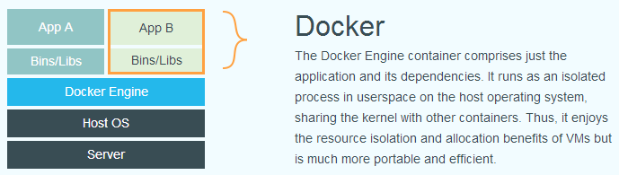

## Docker 简介

### 什么是 Docker

Docker 最初是 dotCloud 公司创始人 Solomon Hykes 在法国期间发起的一个公司内部项目。

Docker 项目后来还加入了 Linux 基金会，并成立推动 开放容器联盟（OCI）。

Docker 使用 Google 公司推出的 Go 语言 进行开发实现，基于 Linux 内核的 cgroup，namespace，以及 OverlayFS 类的 Union FS 等技术，对进程进行封装隔离，属于 操作系统层面的虚拟化技术。由于隔离的进程独立于宿主和其它的隔离的进程，因此也称其为容器。最初实现是基于 LXC，从 0.7 版本以后开始去除 LXC，转而使用自行开发的 libcontainer，从 1.11 开始，则进一步演进为使用 runC 和 containerd。

> runc 是一个 Linux 命令行工具，用于根据 OCI容器运行时规范 创建和运行容器。
> containerd 是一个守护程序，它管理容器生命周期，提供了在一个节点上执行容器和管理镜像的最小功能集。

Docker 在容器的基础上，进行了进一步的封装，从文件系统、网络互联到进程隔离等等，极大的简化了容器的创建和维护。使得 Docker 技术比虚拟机技术更为轻便、快捷。

下面的图片比较了 Docker 和传统虚拟化方式的不同之处。传统虚拟机技术是虚拟出一套硬件后，在其上运行一个完整操作系统，在该系统上再运行所需应用进程；而容器内的应用进程直接运行于宿主的内核，容器内没有自己的内核，而且也没有进行硬件虚拟。因此容器要比传统虚拟机更为轻便。

### 为什么要用 Docker

跟传统虚拟化对比的优势：

+ 更高效的利用系统资源
+ 更快速的启动时间
+ 一致的运行环境
+ 持续交付和部署
+ 更轻松的迁移
+ 更轻松的维护和扩展

|特性|容器|虚拟机|
|---|---|---|
|启动|秒级|分钟级|
|硬盘使用|一般为MB|一般为GB|
|隔离级别|进程|操作系统级别|
|性能|接近原生|弱于|
|系统支持量|单机支持上千个容器|一般几十个|
|虚拟化|虚拟化硬件|虚拟化操作系统|

