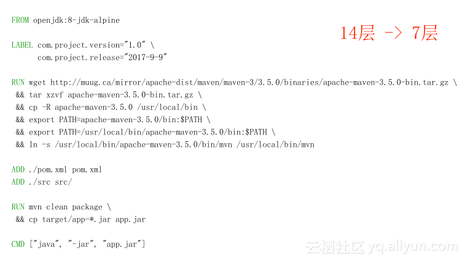

## Docker 镜像优化与最佳实践

### 联合文件系统（Union File System）

联合文件系统（UnionFS）是一种分层、轻量级并且高性能的文件系统，它支持对文件系统的修改作为一次提交来一层层的叠加，同时可以将不同目录挂载到同一个虚拟文件系统下(unite several directories into a single virtual filesystem)。

联合文件系统是 Docker 镜像的基础。镜像可以通过分层来进行继承，基于基础镜像（没有父镜像），可以制作各种具体的应用镜像。

另外，不同 Docker 容器就可以共享一些基础的文件系统层，同时再加上自己独有的改动层，大大提高了存储的效率。

Docker 中使用的 AUFS（AnotherUnionFS）就是一种联合文件系统。 AUFS 支持为每一个成员目录（类似 Git 的分支）设定只读（readonly）、读写（readwrite）和写出（whiteout-able）权限, 同时 AUFS 里有一个类似分层的概念, 对只读权限的分支可以逻辑上进行增量地修改(不影响只读部分的)。

Docker 目前支持的联合文件系统种类包括 AUFS, btrfs, vfs 和 DeviceMapper。


联合文件系统是 Docker 镜像的基础。镜像可以通过分层来进行继承，基于基础镜像（没有父镜像），可以制作各种具体的应用镜像。


### 镜像是什么？

Docker 镜像是一个特殊的文件系统，除了提供容器运行时所需的程序、库、资源、配置等文件外，还包含了一些为运行时准备的一些配置参数（如匿名卷、环境变量、用户等）。镜像不包含任何动态数据，其内容在构建之后也不会被改变。

从一个比较具体的角度去看，镜像就是一个多层存储的文件，相较于普通的ISO系统镜像来说，分层存储会带来两个优点，一个是分层存储的镜像比较容易扩展，比如我们可以基于一个Ubuntu镜像去构建我们的Nginx镜像，这样我们只需要在Ubuntu镜像的基础上面做一些Nginx的安装配置工作，一个Nginx镜像工作就算制作完成了，我们不需要从头开始去制作各种镜像。另一点我们可以优化镜像存储空间，假如我们有两个镜像，Tag1.0镜像和 Tag2.0镜像，我们如果以传统方式去传这两个镜像，每个镜像大概130多兆，但如果我们以分层的方式去存储两个镜像，我们通过下面两个紫色的才能共享，可以节约大量的空间，两个镜像加起来只需要140多兆的空间就可以存下来。这样一是节省了存储空间，二是可以减少网络上的开销，比如我们已经把下面镜像下载了，我们要去下载上面镜像的时候，我们只需要去下10M的部分。


<!--  -->

### 镜像优化

Docker镜像优化层面:

+ 空间优化，也就是优化 Docker 镜像体积
+ 优化 Docker 镜像构建速度，是优化构建的时间

### 镜像优化方式

+ 选择最精简的基础镜像
+ 合理规划镜像的层数
+ 清理镜像构建的中间产物
+ 优化网络需求
+ 构建缓存
+ 使用多阶段构建镜像
+ 编写 .dockerignore 文件

### 最佳实践案例

#### 初次优化：使用轻量级的基础镜像

Docker 的仓库中存在同一个基础镜像的多个版本，为了优化 Docker 体积，我们通常会建议使用 Alpine 类型的版本，因为 Alpine 镜像和类似的其他镜像都经过了优化，其中仅包含最少、必须的软件包，所以它能够节省很多体积。


​ Alpine 类型的镜像被很多开发技术人员优先推荐。但是Alpine镜像也存在很多问题：

+ 使用 Alpine 镜像程序容易报错

因为 Alpine 为了追求精简，很多依赖库都没有，需要一些依赖动态链接库的程序运行时就容易报错，比如 Go 的 cgo 调用。

+ 域名解析行为跟 glibc 有差异

Alpine 镜像的底层库是 musl libc，域名解析行为跟标准 glibc 有差异，需要特殊作一些修复配置，并且有部分选项在 resolv.conf 中配置不支持。

+ 运行 bash 脚本不兼容

因为没有内置 bash，所以运行 bash 的 shell 脚本会不兼容。

#### 多阶段构建镜像


DockerFile最终需要做到的产物其实是JAVA应用，我们对于构建、编译、打包或者安装这些事情都不关心，我们要的其实是最后的产物。所以，我们可以采取分步的方式去做镜像构建，首先我们将之前遇到的所有问题全部都做成基础镜像，上面FROM镜像其实已经改了新的，镜像里面已经把软件源的地址改成了Maven，缓存都已经做好了。我们会去利用缓存，然后添加源代码，我们把前面构建的事情做成了镜像，让镜像去完成构建，然后我们才会去完成把JAVA包拷进去，启动工作，但是两个DockerFile其实是两个镜像，所以我们需要一段脚本去辅助它，第一行的shell脚本是做第一个构建指令，我们指定以Bulid的DockerFile去启动构建，然后生成一个APP Bulid镜像，接下来两行脚本是把镜像生成出来，把里面的构建产物拷出来，然后我们再去做构建，最后把我们需要的JAVA应用给构建出来，这样我们的DockerFile相比之前就更加清晰了，而且分步很简单。


轻舟示例Dockerfile:

```dockerfile
FROM q57n2a84.mirror.aliyuncs.com/library/node:14.15.2 as build
WORKDIR /app
COPY package.json yarn.lock ./
RUN SENTRYCLI_CDNURL=https://npm.taobao.org/mirrors/sentry-cli/ yarn --registry=https://npm.baijia.com/
COPY . .
ARG DEPLOY_ENV
RUN yarn build --$DEPLOY_ENV

FROM q57n2a84.mirror.aliyuncs.com/library/nginx:stable-alpine
COPY --from=build /app/build /apps/website/static/
```

#### 减少镜像的层数 & 利用构建缓存

构建一个镜像的时候，Docker其实提供了一个标准化的构建指令集，当我们去用这些构建指令去写类似于脚本，这种脚本我们称之为DockerFile，Docker可以自动解析DockerFile，并将其构建成一个镜像，所以你就可以简单的认为这是一个标准化的脚本。DockerFile在做一些什么？首先第一行FROM指令表示要以哪一个镜像作为基础镜像进行构建，我们用了openJDK的官方镜像，以JAVA环境作为基础，我们在镜像上面准备跑一个JAVA应用，然后接下来两条LABLE是对镜像进行打标，标下镜像版本和构建日期，然后接下来的六个RUN是做了一个maven安装，maven是JAVA的一个生命周期管理工具，接下来将一些源代码从外面的环境添加到镜像里面，然后两条RUN命令做了打包工作，最后写了一个启动命令。


我们可以减少镜像的层数， Docker对于Docker镜像的层数是有一定要求的，除掉最上面在容器运行时候的读写层以外，我们一个镜像最多只能有127层，如果超过可能会出现问题，所以第二行命令LABLE就可以把它合成一层，减少了层数，下面六个RUN命令做了maven的安装工作，我们也可以把它做成一层，把这些命令串起来，后面的构建我们也可以把它合成一层，这样我们一下就把镜像层数从14层减少到7层，减掉了一半。

我们在做镜像优化的时候，我们希望能够尽量减少镜像的层数，但是和它相对应的是我们DockerFile的可读性，我们需要在这两者之间做折中，我们在保证可读性不受很大影响的情况下去尽量减少它，其实六条RUN命令在做一件事，就是做maven环境打结，做编译环境的准备工作。



接下来我们继续对镜像进行优化，我们可以做一些什么工作呢？在安装maven构建工具的时候我们多加了一行，我们把安装包和展开目录删掉了，我们清理了构建的中间产物，我们要去注意每一个构建指令执行的时候，尽量把垃圾清理掉，我们通过apt-get去装一些软件的时候，我们也可以去做这样的清理工作，就是把这些软件包装完之后就可以把它删掉了，这样可以尽量减少空间，通过增加一行命令，我们可以把镜像的大小从137M削减到119M。

通过apt-get去装软件或者命令基本上是所有编写DockerFile的人都去写的，所以官方已经在debian、Ubuntu的仓库镜像里面默认加了Hack，它会去帮助你在install自动去把源代码删掉。


在 dockerfile 中每执行一条指令，就会提交一次修改，这次修改会保存成一个只读层挂载到联合文件系统，上面层的文件如果和下面层有冲突或不同，会覆盖隐藏底层的文件，所以每增加一层，镜像大小就会增加，但是在 Docker1.10 后有所改变，只有 **RUN、COPY、ADD** 指令会创建层，其他指令会创建临时的中间镜像，不会直接增加构建的镜像大小 。


参考
+ [Docker 镜像优化与最佳实践](https://developer.aliyun.com/article/218452)
+ [Docker：从入门到实践](https://yeasy.gitbook.io/docker_practice/)
