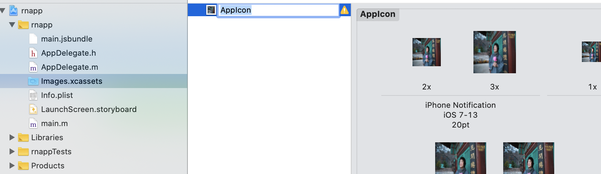
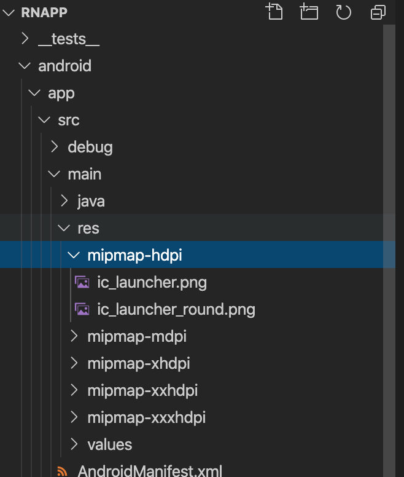

## ReactNative

### app icon

一键生成所有尺寸的应用图标/启动图[图标工场](https://icon.wuruihong.com/)

#### ios

将图标工场生成的icon导入到 appName/Images.xcassets下，如下图：


#### android

在/appName/android/app/src/main/res 目录下以mipmapmin开始命名的目录，替换掉以下相应目录中的ic_launcher.png。


### app开屏

参考[react-native-splash-screen](https://github.com/crazycodeboy/react-native-splash-screen/blob/master/README.zh.md)

#### ios

#### android


### 热更新

[code-push](https://github.com/Microsoft/code-push)

[app-center(微软)](https://appcenter.ms/)

[code-push-server(自建)](https://github.com/lisong/code-push-server)

code-push常用命令：
|command|comment|
|---|---|
|access-key|View and manage the access keys associated with your account 显示登录的token|
|app|View and manage your CodePush apps 查看和管理app|
|collaborator|View and manage app collaborators 查看和管理协作人员|
|debug|View the CodePush debug logs for a running app|
|deployment|View and manage your app deployments 查看和管理部署|
|link|Link an additional authentication provider (e.g. GitHub) to an existing Mobile Center account|
|login|Authenticate in order to begin managing your apps 登录|
|logout|Log out of the current session 注销|
|patch|Update the metadata for an existing release|
|promote|Promote the latest release from one app deployment to another|
|register|Register a new Mobile Center account|
|release|Release an update to an app deployment|
|release-cordova|Release a Cordova update to an app deployment|
|release-react|Release a React Native update to an app deployment|
|rollback|Rollback the latest release for an app deployment|
|whoami|Display the account info for the current login session|

#### app-center

+ code-push login
+ code-push app add myRnApp ios react-native / code-push app add myRnApp android react-native
+ code-push loout 注销
+ code-push access-key ls 列出登陆的token
+ code-push access-key rm <accessKye> 删除某个 access-key

+ 显示当前的版本信息
code-push deployment ls myRnApp -k


#### code-push-server

+ code-push login http://127.0.0.1:3000

#### 配置

+ [ios](https://github.com/microsoft/react-native-code-push/blob/master/docs/multi-deployment-testing-ios.md)
+ [android](https://github.com/microsoft/react-native-code-push/blob/master/docs/multi-deployment-testing-android.md)


#### 发布更新

两种方式：
+ code-push react-release(更简单)
```bash
code-push release-react MyApp-iOS ios
code-push release-react MyApp-Android android
code-push release-react test-code-push --t 1.0.0 --dev false --des "测试热更新" --m true
# 参数--t为二进制(.ipa与apk)安装包的的版本；--dev为是否启用开发者模式(默认为false)；-d是要发布更新的环境分Production与Staging(默认为Staging)；--des为更新说明；--m 是强制更新。
```
+ code-push release
code-push release发布更新, 首先需要将js与图片资源进行打包成 bundle。
```bash
mkdir -p build/ios && react-native bundle --entry-file index.js --bundle-output ./build/ios/main.jsbundle --platform ios --dev false  --assets-dest ./build/ios

code-push release myAppIos ./build/ios '*' --des '测试热更新' --m true
code-push release myAppAndroid ./build/android '*' --des '测试热更新' --m true
```

### 使用字体图标

```
import { createIconSetFromIcoMoon } from 'react-native-vector-icons'
import icoMoonConfig from '@/assets/icomoon/selection.json'

const Icon = createIconSetFromIcoMoon(icoMoonConfig, 'Icomoon', 'icomoon.ttf')
export default Icon

// export const Button = Icon.Button
// export const TabBarItem = Icon.TabBarItem
```

### react-native-swiper

### 自适应布局


### ReactNative与原生通信
#### ReactNative调用原生模块方法

[参考](https://reactnative.cn/docs/native-modules-ios#content)
```
```

### 集成Firebase


### 遇到的一些小问题

#### clone下的项目npm install后仍报一些module缺失问题

+ watchman watch-del-all
+ rm -rf node_modules
+ yarn install
+ yarn start --reset-cache

#### react-native-http-cache

##### ios

[react-native-http-cache](https://github.com/reactnativecn/react-native-http-cache)

在React Native 版本高于0.60后会有报错，'React/RCTDefines.h' file not found。
解决办法：
```
#if __has_include("RCTDefines.h")
  #import "RCTDefines.h"
#else
 #import <React/RCTDefines.h>
#endif
```

##### android

[react native清除APP缓存的功能实现](https://zhuanlan.zhihu.com/p/75859814)

#### Failed to open zip file. Gradle's dependency cache may be corrupt (this sometimes occurs after a network connection timeout.)

更改gradle-wrapper.properties，
```
distributionUrl=https\://services.gradle.org/distributions/gradle-6.5.1-all.zip // 选择一个合适的版本
```

建议使用：[@yz1311/react-native-http-cache](https://github.com/yz1311/react-native-http-cach)，对react-native-http-cache的升级。

#### Text 多行文本省略
设置 flex: 1 后可能会导致失效
```
<Text numberOfLines={2}>hellohellohellohellohellohellohellohellohellohello</Text>

####  TouchableWithoutFeedback

TouchableWithoutFeedback 组件内直接渲染另外一个组件，可能导致onPress事件无法触发。

```

#### webview 注入js、css

```javascript
const INJECTEDJAVASCRIPT = `
  const meta = document.createElement('meta');
  meta.setAttribute('content', 'initial-scale=1, maximum-scale=1, user-scalable=0');
  meta.setAttribute('name', 'viewport');
  document.getElementsByTagName('head')[0].appendChild(meta);
  var style = document.createElement('style');
  style.type = 'text/css';
  style.innerHTML="body{ margin: 0; padding: 0 }";
  document.getElementsByTagName('HEAD').item(0).appendChild(style);
`;

<WebView
  javaScriptEnabled={true}
  scalesPageToFit={false}
  injectedJavaScript={INJECTEDJAVASCRIPT}
  source={{
    html: ``,
  }}
/>
```

*参考文档*
+ [react-native热更新之CodePush详细介绍及使用方法](https://blog.csdn.net/qq_33323251/article/details/79437932)
+ [CodePush 命令行](https://github.com/microsoft/code-push/blob/v3.0.1/cli/README-cn.md)
+ [React Native 的默认单位和自适应布局方案](https://segmentfault.com/a/1190000004878644)