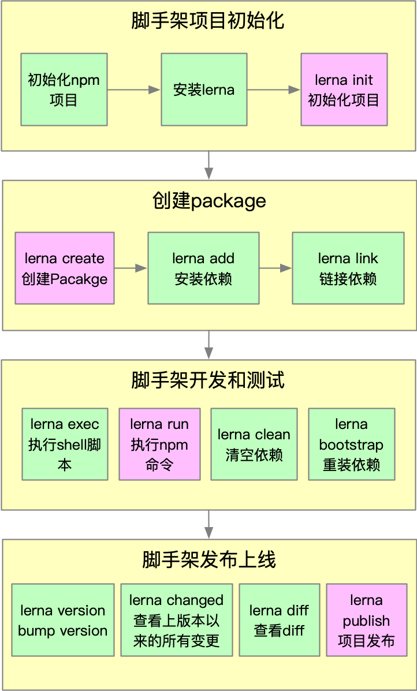

## lerna

> Lerna is a tool that optimizes the workflow around managing multi-package repositories with git and npm.

Lerna 是一个优化基于 git+npm 的多 package 项目的管理工具.

优势：

+ 大幅减少重复操作
+ 提升操作的标准化

> Lerna 是架构优化的产物，它揭示了一个架构真理：项目复杂度提升后，就需要对项目进行架构优化。架构优化的主要目标往往都是以效能为核心。

### lerna 开发脚手架流程

### lerna 基本命令

+ lerna init
+ lerna create
+ lerna add
+ lerna clean
+ lerna bootstrap
+ lerna run
+ lerna clean
+ lerna changed
+ lerna diff
+ lerna publish
