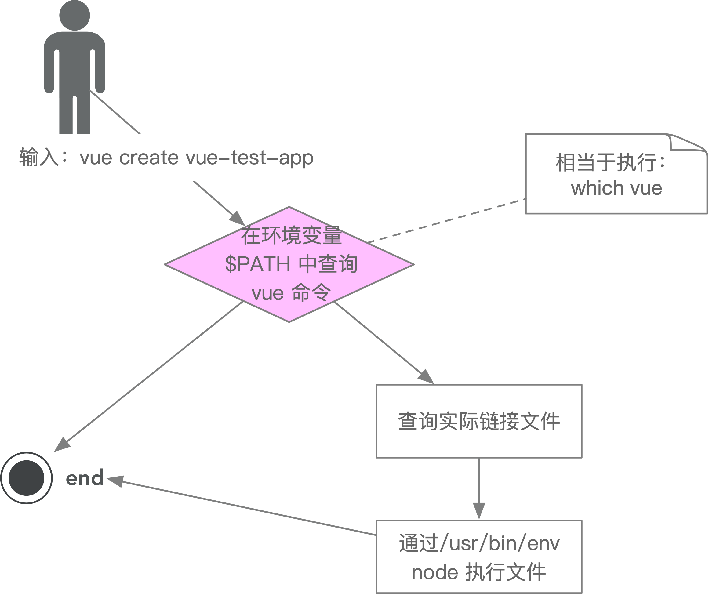

## 脚手架实现原理

+ 为什么全局安装 @vue/cli 后会添加的命令为 vue？
  > 源代码中 vue/cli 中 package.json bin 指定了 vue 命令，所以全局安装后会添加 vue 命令。
  > vue 软连接 指向 @vule/cli/bin/vue.js
  >```json
  > {
  >  bin: {
  >    vue: '@vule/cli/bin/vue.js'
  >  }
  > }
  ```

+ 全局安装 @vue/cli 时发生了什么？
> 下载依赖，配置软连接，添加命令。
+ 为什么 vue 指向一个 js 文件，我们却可以直接通过 vue 命令直接去执行它？
> 全局环境变量中寻找 vue 命令
> #!/usr/bin/env node 这句话是我们直接执行vue命令的原因

### 脚手架原理进阶




```shell
/usr/bin/env node test.js
./test.js
node test.js
```


+ 创建软连接可以实现直接执行文件 imooc
```shell
ln -s /Users/mac/github/fe-blog/imooc/test.js imooc
```

```shell
#!/usr/bin/env node
#!/usr/bin/node
```
+ 第一种是在环境变量中查找 node
+ 第二种是直接执行 /usr/bin/ 目录下的 node
