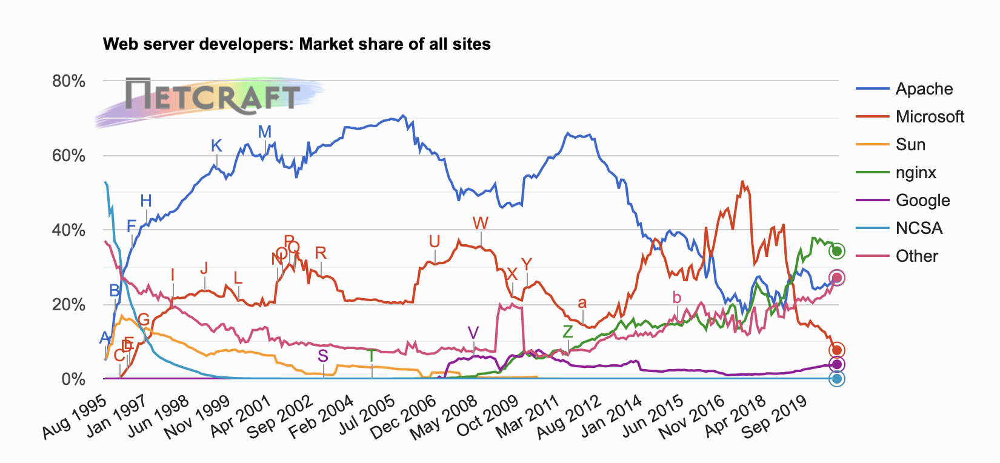
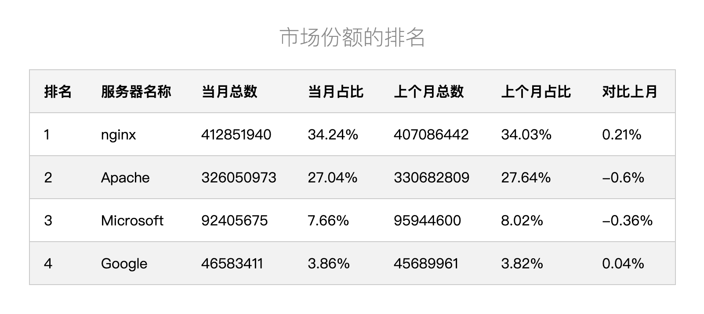

## nginx

### 基本概念

Nginx (engine x) 是一款轻量级的 Web 服务器 、反向代理服务器及电子邮件（IMAP/POP3）代理服务器。





+ Apache：Apache 软件基金会的一个开放源码的网页服务器，可以在大多数计算机操作系统中运行。由于其多平台和安全性被广泛使用，是最流行的 Web服务器端软件之一。它快速、可靠并且可通过简单的 API 扩展，将 Perl/Python 等解释器编译到服务器中。
+ Microsoft：微软提供的基于运行 Microsoft Windows 的互联网基本服务。互联网信息服务（Internet Information Services），简称 IIS。
+ Google：谷歌自主开发的 Google Web Server，简称 gws 。
+ nginx：由伊戈尔·赛索耶夫为俄罗斯访问量第二的 Rambler.ru 站点开发的，免费开源、轻量级、高性能 Web 服务器。

#### 为什么选择 nginx？

+ 更快
  + 正常情况下，单次次请求的响应更快
  + 高并发情况下，相比其他服务器响应更快
+ 高扩展性

  nginx 由不同层次，不同功能，不同类型的低耦合的模块组成。
+ 高可靠性

  Master/Wokr工作模式
+ 低内存消耗

  一般情况下，10000个非常活跃的HTTP keep-alive连接在nginx中仅消耗2.5MB内存。
+ 单机支持10w以上的并发连接

  理论上，Nginx支持的并发连接上限取决于内存，10w远未封顶。
+ 热部署
+ 最自由的BSD协议


#### 正向代理 & 反向代理


#### 负载均衡


### nginx 常用命令

+ nginx -v 查看版本

```bash
root@c598124ca7bf:/# nginx -v
nginx version: nginx/1.19.4
```

+ nginx -s stop 关闭

关闭 nginx

+ nginx -s reload 重加载

改变配置文件后，重新启动

### nginx配置文件

查找位置：nginx -t

#### nginx配置构成

+ 全局块

从配置文件开始到events之间的模块。配置

```bash
work_process
```

+ events

events 主要影响 nginx 服务器与用户网络的链接

+ http

nginx中配置最频繁的部分。

http分文全局块，server 块。