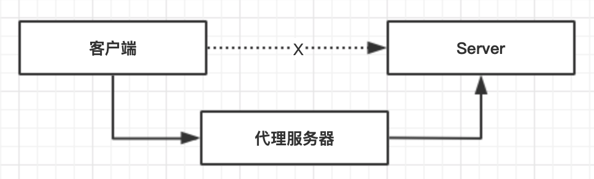
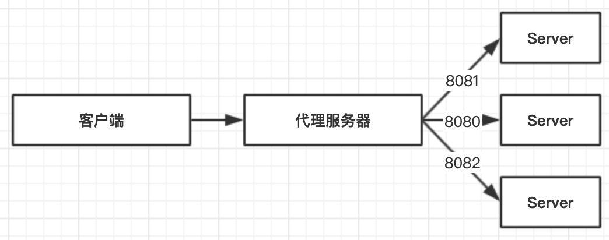
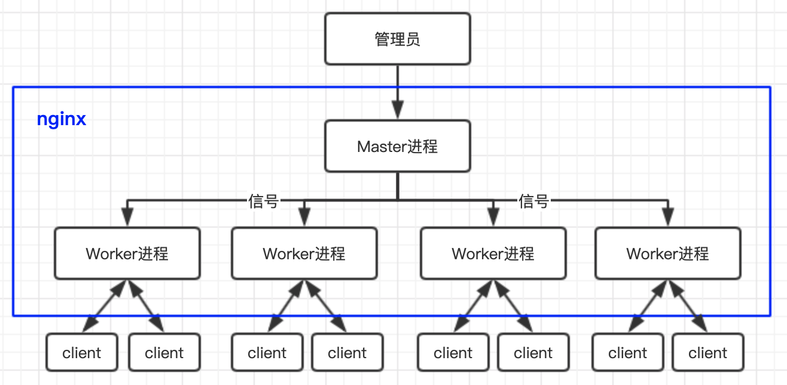

## nginx

### 基本概念

Nginx (engine x) 是一款轻量级的 Web 服务器 、反向代理服务器及电子邮件（IMAP/POP3）代理服务器。

由伊戈尔·赛索耶夫创建并于2004年首次公开发布。2011年成立同名公司以提供支持。2019年3月11日，Nginx公司被F5 Networks以6.7亿美元收购。

Nginx是免费的开源软件，根据类BSD许可证的条款发布。一大部分Web服务器使用Nginx，通常作为负载均衡器。


+ Apache：Apache 软件基金会的一个开放源码的网页服务器，可以在大多数计算机操作系统中运行。由于其多平台和安全性被广泛使用，是最流行的 Web服务器端软件之一。它快速、可靠并且可通过简单的 API 扩展，将 Perl/Python 等解释器编译到服务器中。
+ Microsoft：微软提供的基于运行 Microsoft Windows 的互联网基本服务。互联网信息服务（Internet Information Services），简称 IIS。
+ Google：谷歌自主开发的 Google Web Server，简称 gws 。
+ nginx：由伊戈尔·赛索耶夫为俄罗斯访问量第二的 Rambler.ru 站点开发的，免费开源、轻量级、高性能 Web 服务器。

#### Tengine

[Tengine](http://tengine.taobao.org/)

> Tengine是由淘宝网发起的Web服务器项目。它在Nginx的基础上，针对大访问量网站的需求，添加了很多高级功能和特性。Tengine的性能和稳定性已经在大型的网站如淘宝网，天猫商城等得到了很好的检验。它的最终目标是打造一个高效、稳定、安全、易用的Web平台。

#### OpenResty

[OpenResty](https://openresty.org/cn/)

> OpenResty® 是一个基于 Nginx 与 Lua 的高性能 Web 平台，其内部集成了大量精良的 Lua 库、第三方模块以及大多数的依赖项。用于方便地搭建能够处理超高并发、扩展性极高的动态 Web 应用、Web 服务和动态网关。

#### 国内主流网站的使用情况

+ 百度主页

  ```bash
  $ curl -I https://www.baidu.com/
  HTTP/1.1 200 OK
  Accept-Ranges: bytes
  Cache-Control: private, no-cache, no-store, proxy-revalidate, no-transform
  Connection: keep-alive
  Content-Length: 277
  Content-Type: text/html
  Date: Tue, 24 Nov 2020 09:23:21 GMT
  Etag: "575e1f5d-115"
  Last-Modified: Mon, 13 Jun 2016 02:50:05 GMT
  Pragma: no-cache
  Server: bfe/1.0.8.18
  ```
+ 淘宝主站

  ```bash
  $ curl -I https://www.taobao.com/
  HTTP/2 200
  server: Tengine
  ...
  ```
+ 腾讯主站

  ```bash
  $ curl -I https://www.qq.com/
  HTTP/2 200
  date: Tue, 24 Nov 2020 09:26:35 GMT
  content-type: text/html; charset=GB2312
  server: squid/3.5.24
  ...
  ```
+ 腾讯邮箱

  ```bash
  $ curl -I https://mail.qq.com/
  HTTP/2 200
  server: nginx
  ...
  ```
+ 新浪

  ```bash
  $ curl -I https://sina.com/
  HTTP/1.1 200 OK
  Server: nginx/1.13.7
  ...
  ```

+ 头条

  ```bash
  $ curl -I https://www.toutiao.com/
  HTTP/2 200
  server: Tengine
  ...
  ```
+ 京东

  ```bash
  $ curl -I https://www.jd.com/
  HTTP/1.1 200 OK
  Server: nginx
  ...
  ```
+ 美团

  ```bash
  $ curl -I https://www.meituan.com/
  HTTP/1.1 302 Moved Temporarily
  Server: openresty
  ```

#### 为什么选择 nginx？

+ 更快
  + 正常情况下，单次次请求的响应更快
  + 高并发情况下，相比其他服务器响应更快
+ 高扩展性

  nginx 由不同层次，不同功能，不同类型的低耦合的模块组成。
+ 高可靠性

  Master/Wokr工作模式
+ 低内存消耗

  一般情况下，10000个非活跃的HTTP keep-alive连接在nginx中仅消耗2.5MB内存。
+ 单机支持10w以上的并发连接

  理论上，Nginx支持的并发连接上限取决于内存，10w远未封顶。
+ 热部署
+ 最自由的BSD协议


#### 正向代理



正向代理是一个位于客户端和目标服务器之间的服务器(代理服务器)，为了从目标服务器取得内容，客户端向代理服务器发送一个请求并指定目标，然后代理服务器向目标服务器转交请求并将获得的内容返回给客户端。

为什么要使用正向代理：

+ 突破访问限制

  比如我们日常使用VPN来访问国外网站

+ 提高访问速度

  通常代理服务器都设置一个较大的硬盘缓冲区，会将部分请求的响应保存到缓冲区中，当其他用户再访问相同的信息时， 则直接由缓冲区中取出信息，传给用户，以提高访问速度。

+ 隐藏客户端真实IP


#### 反向代理



反向代理是指以代理服务器来接受internet上的连接请求，然后将请求转发给内部网络上的服务器，并将从服务器上得到的结果返回给internet上请求连接的客户端，此时代理服务器对外就表现为一个反向代理服务器。


为什么使用反向代理?

+ 保护和隐藏原始资源服务器
+ 加密和SSL加速
+ 通过缓存静态资源，加速Web请求
+ 实现负载均衡

#### 正向代理与反向代理的区别

+ 正向代理和反向代理的区别在于代理的对象不同。正向代理代理的是客户端，反向代理代理的是服务端。

+ 正向代理一般是在客户端架设，比如安装代理软件等，反向代理一般是服务端架设。

+ 正向代理中，服务器不知道真正的客户端到底是谁，以为访问自己的就是真实的客户端。而在反向代理中，客户端不知道真正的服务器是谁，以为自己访问的就是真实的服务器

+ 正向代理和反向代理的作用和目的不同。正向代理主要是用来解决访问限制问题。而反向代理则是提供负载均衡、安全防护等作用。二者均能提高访问速度。

#### 负载均衡


### nginx 进程模型



### nginx 常用命令

|参数|含义|
|---|---|
|-?,-h|this help|
|-v|show version and exit|
|-V|show version and configure options then exit|
|-t|test configuration and exit|
|-T|test configuration, dump it and exit|
|-q|suppress non-error messages during configuration testing|
|-s signal|send signal to a master process: stop, quit, reopen, reload|
|-p prefix|set prefix path (default: /etc/nginx/)|
|-c filename|set configuration file (default: /etc/nginx/nginx.conf)|
|-g directives|set global directives out of configuration file|


### nginx配置文件

#### demo

```bash
user  nginx;
worker_processes  1;

error_log  /var/log/nginx/error.log warn;
pid        /var/run/nginx.pid;


events {
    worker_connections  1024;
}


http {
    include       /etc/nginx/mime.types;
    default_type  application/octet-stream;

    log_format  main  '$remote_addr - $remote_user [$time_local] "$request" '
                      '$status $body_bytes_sent "$http_referer" '
                      '"$http_user_agent" "$http_x_forwarded_for"';

    access_log  /var/log/nginx/access.log  main;

    sendfile        on;
    #tcp_nopush     on;

    keepalive_timeout  65;

    #gzip  on;

    include /etc/nginx/conf.d/*.conf;
}
```

#### 语法

+ 配置文件由指令与指令块构成
+ 每条指令以;分号结尾，指令与参数间以空格符合分割
+ 指令块以{} 大括号将多条指令组织在一起
+ include 语句允许组合多个配置文件以提升可维护性
+ 使用 # 符号添加注释，提高可读性
+ 使用 $ 符号使用变量
+ 部分指令的参数支持正则表达式

#### nginx配置构成

+ 全局块

  从配置文件开始到events之间的模块配置，配置影响nginx全局的指令。一般有运行nginx服务器的用户组，nginx进程pid存放路径，日志存放路径，配置文件引入，允许生成worker process数等。

  ```bash
  user
  work_process: auto | 4;
  ```

+ events

  events 主要影响 nginx 服务器与用户网络的链接。有每个进程的最大连接数，选取哪种事件驱动模型处理连接请求，是否允许同时接受多个网路连接，开启多个网络连接序列化等
  ```bash
  events {
    use epoll;
    work_connections 65535;
    # ...
  }
  ```

+ http

  nginx中配置最频繁的部分。可以嵌套多个server，配置代理，缓存，日志定义等绝大多数功能和第三方模块的配置。

  http分为全局块，server 块。
  ```bash
  http {
    include       mime.types;
    default_type  application/octet-stream;
    upstream node_cluster {
      server 10.16.48.158:8080;
      server 10.16.48.158:8081;
      server 10.16.48.158:8082;
    }
    server {
      server_name docker.test;
      listen 80;
      index index.html index.htm;
      root /apps/;
      location ~ /docker/ {
        proxy_pass http://node_cluster;
        proxy_http_version 1.1;
        proxy_set_header Upgrade $http_upgrade;
        proxy_set_header Connection 'upgrade';
        proxy_set_header Host $host;
        proxy_cache_bypass $http_upgrade;
      }
      access_log  /var/log/nginx/docker.test.log;
      error_log  /var/log/nginx/docker.test.error.log;
    }
  }
  ```

#### 全局块


#### events 配置模块
#### http 配置模块

### nginx负载均衡的几种方法

#### 轮询(round-robin)

每个请求按时间顺序逐一分配到不同的后端服务器，如果后端服务器down掉，能自动剔除

```bash
upstream node_cluster {
    server 10.16.48.158:8080;
    server 10.16.48.158:8081;
    server 10.16.48.158:8082;
}
server {
    ...
    location ~ /docker/ {
        proxy_pass http://node_cluster;
    }
    ...
}
```

#### 加权轮询

```
upstream node_cluster {
    server 10.16.48.158:8080 weight=2;
    server 10.16.48.158:8081 weight=1;
    server 10.16.48.158:8082 weight=1;
}
server {
    ...
    root /apps/;
    location ~ /docker/ {
        proxy_pass http://node_cluster;
        ...
    }
}
```

#### ip-hash

根据每个请求的ip的hash结果分配，因此每个固定ip能访问到同一个后端服务器，可以解决session问题。

```config
upstream node_cluster {
    ip_hash;
    server 10.16.48.158:8080;
    server 10.16.48.158:8081;
    server 10.16.48.158:8082;
}
server {
    ...
    root /apps/;
    location ~ /docker/ {
        proxy_pass http://node_cluster;
        ...
    }
}
```

#### 热备

```bash
upstream node_cluster {
    ip_hash;
    server 10.16.48.158:8080;
    server 10.16.48.158:8081;
    server 10.16.48.158:8082 back;
}
```

#### 其他的一些方式
+ fair（第三方）

  按照后端服务器的响应时间来分配请求，响应时间短的优先分配。
  ```bash
  upstream favresin{
      server 10.0.0.10:8080;
      server 10.0.0.11:8080;
      fair;
  }
  ```
+ url_hash（第三方）

  按访问url的hash结果来分配请求，使每个url定向到同一个后端服务器，后端服务器为缓存时比较有效。
  ```bash
  upstream resinserver{
      server 10.0.0.10:7777;
      server 10.0.0.11:8888;
      hash $request_uri;
      hash_method crc32;
  }
  ```
#### 参数解释

+ down，表示当前的server暂时不参与负载均衡。
+ backup，预留的备份机器。当其他所有的非backup机器出现故障或者忙的时候，才会请求backup机器，因此这台机器的压力最轻。
+ max_fails，允许请求失败的次数，默认为1。当超过最大次数时，返回proxy_next_upstream 模块定义的错误。
+ fail_timeout，请求失败超时时间，在经历了max_fails次失败后，暂停服务的时间。max_fails和fail_timeout可以一起使用


*参考*
+ [nginx中文文档](https://www.nginx.cn/doc/)
+ [Nginx开发从入门到精通](http://tengine.taobao.org/book/index.html#)
+ [终于有人把正向代理和反向代理解释的明明白白了](https://cloud.tencent.com/developer/article/1418457)
+ [nignx 负载均衡的几种算法介绍](https://www.cnblogs.com/lvgg/p/6140584.html)
