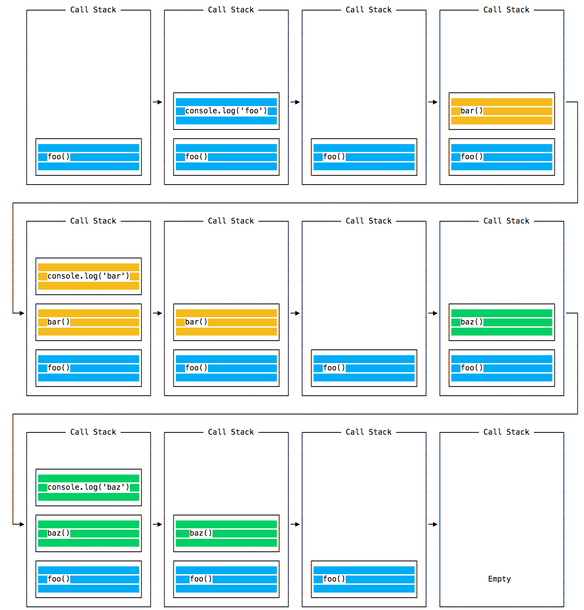
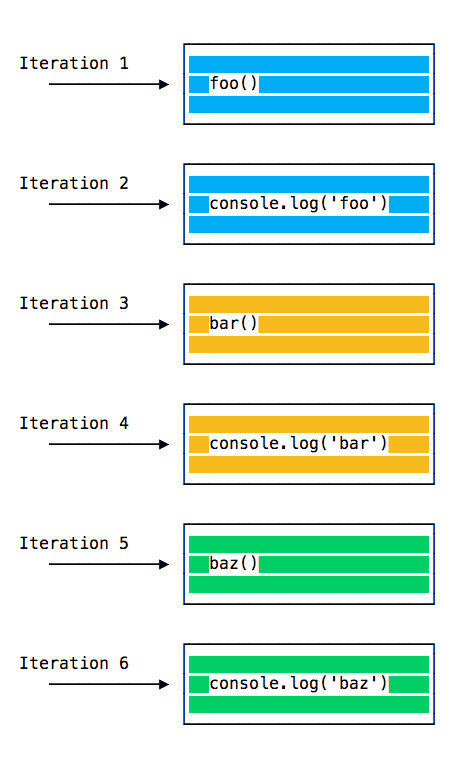
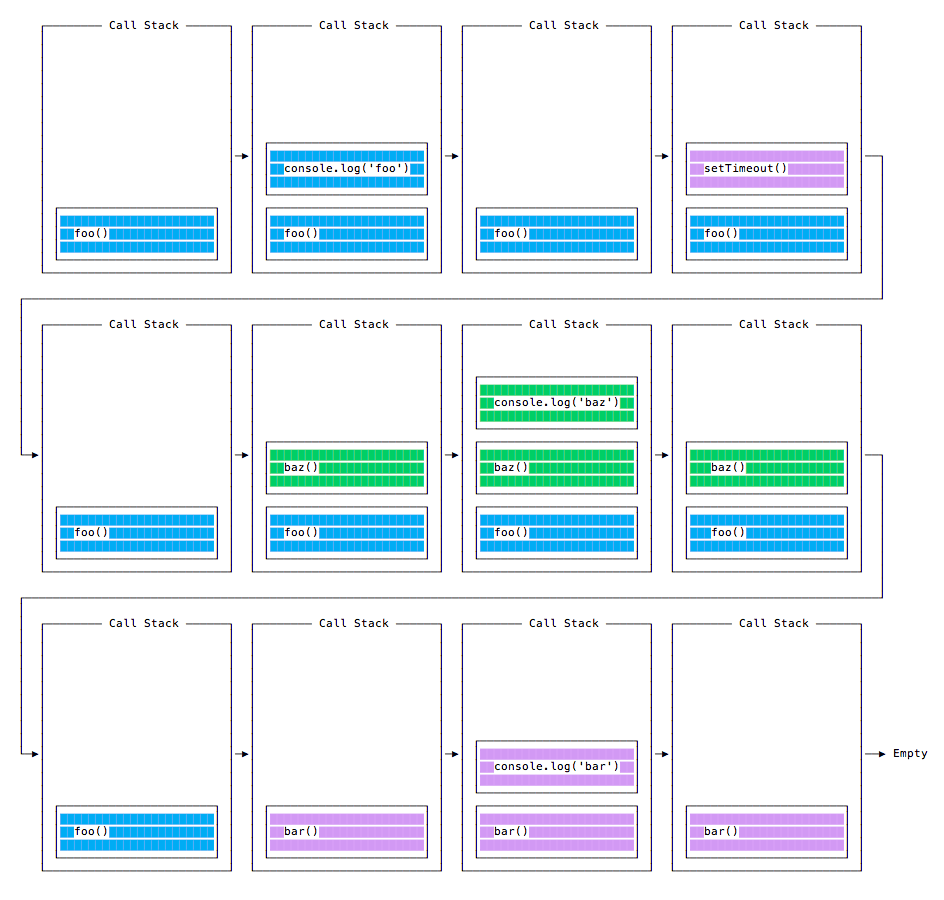

## Node.js事件循环

Node.js javascript 代码运行在单个线程上，每次只处理一件事。

### 调用堆栈

调用堆栈是一个LIFO 队列（后进先出）。
事件循环不断的检查调用堆栈，查看是否需要运行任何函数。

### 简单的事件循环阐释

```javascript

const bar = () => console.log('bar);

const baz = () => console.log('baz');

const foo = () => {
  console.log('foo');
  bar();
  baz();
}
foo();

// 输出
// foo
// bar
// baz
```
运行次代码时，会首先调用foo()。在 foo() 内部，一次调用 bar()， baz()。

调用堆栈如下所示：



每次迭代中的事件循环都会查看调用堆栈中是否有东西，并执行它直到调用堆栈为空：



### 入队函数执行

```javascript
const bar = () => console.log('bar);

const baz = () => console.log('baz');

const foo = () => {
  console.log('foo');
  setTimeout(bar, 0);
  baz();
}
foo();

// 输出
// foo
// baz
// bar
```
当运行此代码时，会首先调用 foo()。 在 foo() 内部，会首先调用 setTimeout，将 bar 作为参数传入，并传入 0 作为定时器指示它尽快运行。 然后调用 baz()。

此时调用堆栈如下：



为什么跟第一次的情况不同呢？

### 消息队列

当调用 setTimeout() 时，浏览器或 Node.js 会启动定时器。 当定时器到期时（在此示例中会立即到期，因为将超时值设为 0），则回调函数会被放入“消息队列”中。

在消息队列中，用户触发的事件（如单击或键盘事件、或获取响应）也会在此排队，然后代码才有机会对其作出反应。 类似 onLoad 这样的 DOM 事件也如此。

事件循环会赋予调用堆栈优先级，它首先处理在调用堆栈中找到的所有东西，一旦其中没有任何东西，便开始处理消息队列中的东西。

我们不必等待诸如 setTimeout、fetch、或其他的函数来完成它们自身的工作，因为它们是由浏览器提供的，并且位于它们自身的线程中。 例如，如果将 setTimeout 的超时设置为 2 秒，但不必等待 2 秒，等待发生在其他地方。

### ES6 作业队列

ECMAScript 2015 引入了作业队列的概念，Promise 使用了该队列（也在 ES6/ES2015 中引入）。 这种方式会尽快地执行异步函数的结果，而不是放在调用堆栈的末尾。

在当前函数结束之前 resolve 的 Promise 会在当前函数之后被立即执行。

有个游乐园中过山车的比喻很好：消息队列将你排在队列的后面（在所有其他人的后面），你不得不等待你的回合，而工作队列则是快速通道票，这样你就可以在完成上一次乘车后立即乘坐另一趟车。

```javascript
const bar = () => console.log('bar')

const baz = () => console.log('baz')

const foo = () => {
  console.log('foo')
  setTimeout(bar, 0)
  new Promise((resolve, reject) =>
    resolve('应该在 baz 之后、bar 之前')
  ).then(resolve => console.log(resolve))
  baz()
}

foo()

// 输出
// foo
// baz
// 应该在 baz之后、bar之前
// bar
```


**参考**

1. [node.js入门教程](http://nodejs.cn/learn)
