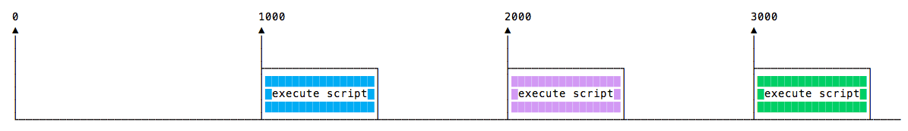
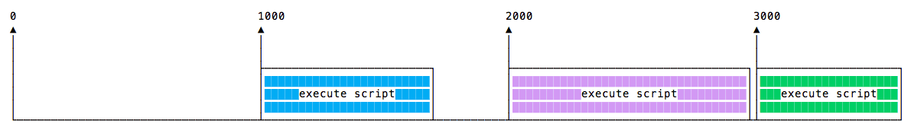
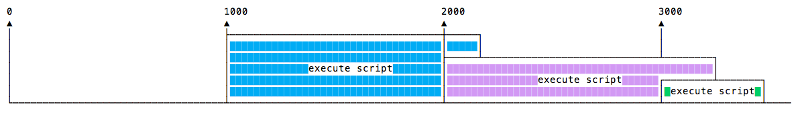
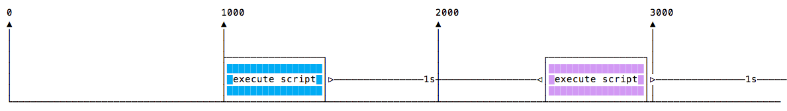

## Javascript定时器

### setTimeout()

setTimeout(), 指定一个回调函数，并指定希望它稍后运行的时间（以毫秒为单位）的值。

```javascript
setTimeout(() => {
  // 2 秒之后
}, 2000);
```

setTimeout 会返回定时器 id， 在需要删除定时器时清除：

```javascript
const id = setTimeout(() => {
  // do something
}, 2000);

clearTimeout(id);
```

#### 零延迟

如果将超时延迟指定为 0，则回调函数会被尽快执行（但是是在当前函数执行之后）:

```javascript
setTimeout(() => {
  console.log("next");
}, 0);

console.log('now')
```

通过在调度程序中排队函数，可以避免在执行繁重的任务时阻塞 CPU，并在执行繁重的计算时执行其他函数。

>某些浏览器（IE 和 Edge）实现的 setImmediate() 方法具有相同的确切功能，但是不是标准的，并且在其他浏览器上不可用。但是在 Node.js 中它是标准的函数。

### setInterval

setInterval 类似于 setTimeout 函数，但是不同之处在于：它会在指定的时间间隔（以毫秒为单位）一直运行回调函数，而不是只运行一次。

同样，当想要清除该定时器时，使用 clearInterval:

```javascript
const id = setInterval(() => {
  // do something
}, 2000);

clearInterval(id);
```

### 递归的 setTimeout

setInterval 每 n毫秒启动一个函数，而无需考虑何时完成执行。

如果一个函数总花费相同的时间：



函数可能需要不同的执行时间：



也许一个较长的执行时间，会导致与下一次执行重叠：



为避免这种情况，可以在回调函数完成时，安排要被调用的递归的 setTimeout

```javascript
const myFunction = () => {
  // do something
  setTimeout(myFunction, 1000);
}

setTimeout(myFunction, 1000);
```
此时：



setTimeout 和 setInterval 可通过定时器模块在 Node.js 中使用。

Node.js 还提供 setImmediate()（相当于使用 setTimeout(() => {}, 0)），通常用于与 Node.js 事件循环配合使用。