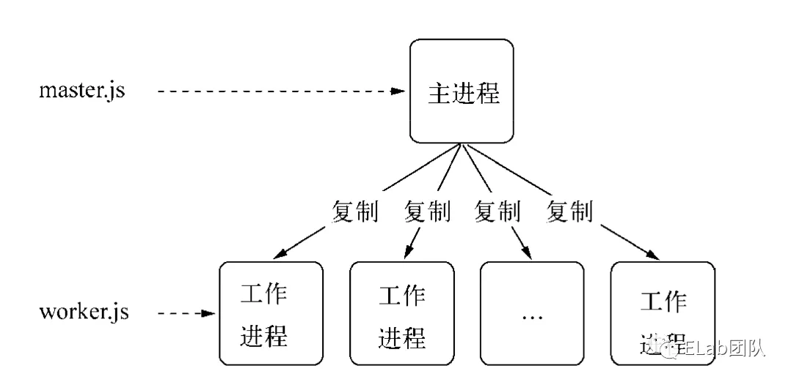
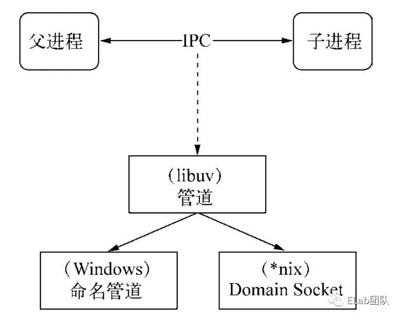
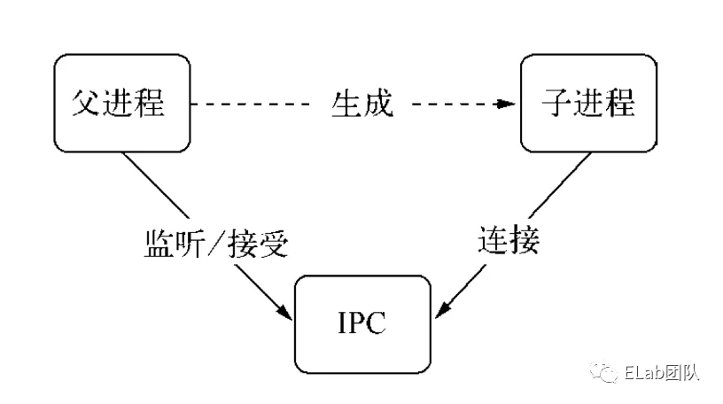
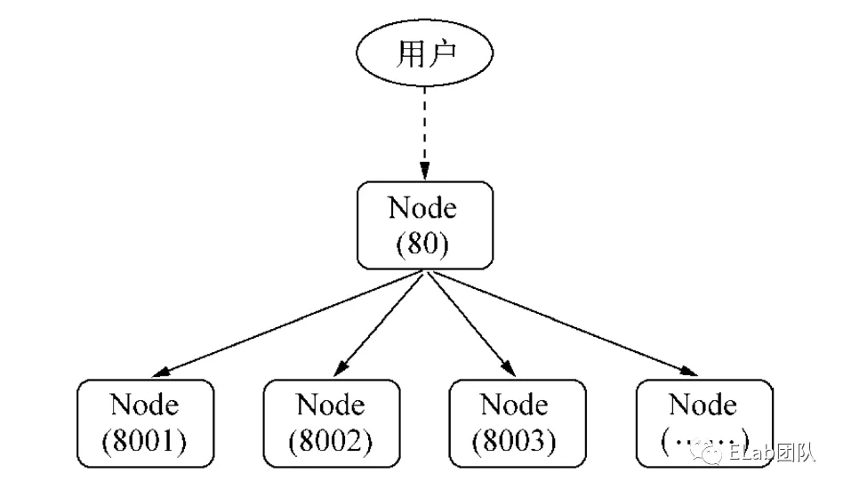

## Ndoejs childe_process

### 子进程的创建

child_process 模块提供了四个创建子进程的方法：

+ child_process.spawn(command, args)
+ child_process.exec(command, options)
+ child_process.execFile(file, args[,callback])
+ child_process.fork(modulePath, args)

|类型|回调/异常|进程类型|执行类型|可设置超时|
|---|---|---|---|---|
|spawn()|x|任意|命令|x|
|exec()|√|任意|命令|√|
|execFile()|√|任意|可执行文件|√|
|fork()|x|Node|Javascript文件|x|

后三种方法都是 **spawn()** 延伸。

Nodejs中，子进程使用*send()*方法实现主进程向子进程发送数据， *message*事件，实现主进程收听子进程发来的数据。

### IPC(Interprocess Communication) 进程间通信

IPC 即进程间通信，可以让不同进程之间能够相互访问资源并协调工作。

实际上，父进程会在创建子进程之前，会先创建 IPC 通道并监听这个 IPC，然后再创建子进程，通过环境变量（NODE_CHANNEL_FD）告诉子进程和 IPC 通道相关的文件描述符，子进程启动的时候根据文件描述符连接 IPC 通道，从而和父进程建立连接。

### 句柄传递

句柄是一种可以用来标识资源的引用的，它的内部包含了指向对象的文件资源描述符。

一般情况下，当我们想要将多个进程监听到一个端口下，可能会考虑使用主进程代理的方式处理：

然而，这种代理方案会导致每次请求的接收和代理转发用掉两个文件描述符，而系统的文件描述符是有限的，这种方式会影响系统的扩展能力。

所以，为什么要使用句柄？原因是在实际应用场景下，建立 IPC 通信后可能会涉及到比较复杂的数据处理场景，句柄可以作为 send() 方法的第二个可选参数传入，也就是说可以直接将资源的标识通过 IPC 传输，避免了上面所说的代理转发造成的文件描述符的使用。