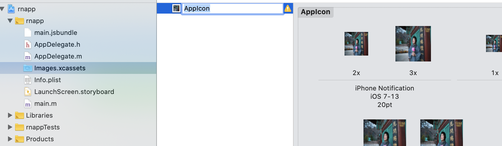
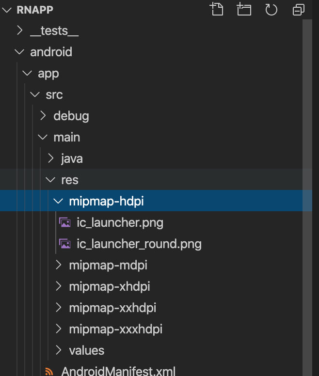
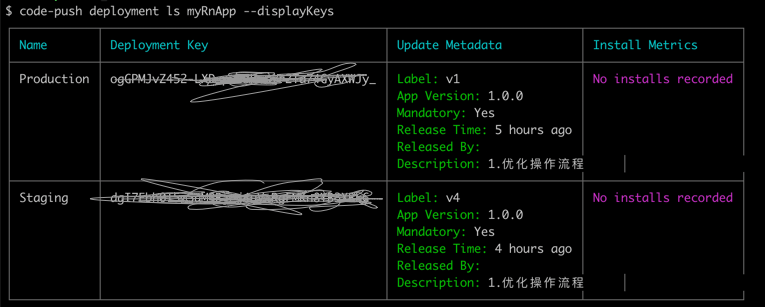

## ReactNative

### app icon

一键生成所有尺寸的应用图标/启动图[图标工场](https://icon.wuruihong.com/)

#### ios

将图标工场生成的icon导入到 appName/Images.xcassets下，如下图：

#### android

在/appName/android/app/src/main/res 目录下以mipmapmin开始命名的目录，替换掉以下相应目录中的ic_launcher.png。

### app开屏

参考[react-native-splash-screen](https://github.com/crazycodeboy/react-native-splash-screen/blob/master/README.zh.md)

#### ios

#### android

### 热更新

[app-center(微软)]()

[code-push-server(自建)](https://github.com/lisong/code-push-server)

code-push常用命令：
|command|comment|
|---|---|
|access-key|View and manage the access keys associated with your account 显示登录的token|
|app|View and manage your CodePush apps 查看和管理app|
|collaborator|View and manage app collaborators 查看和管理协作人员|
|debug|View the CodePush debug logs for a running app|
|deployment|View and manage your app deployments 查看和管理部署|
|link|Link an additional authentication provider (e.g. GitHub) to an existing Mobile Center account|
|login|Authenticate in order to begin managing your apps 登录|
|logout|Log out of the current session 注销|
|patch|Update the metadata for an existing release|
|promote|Promote the latest release from one app deployment to another|
|register|Register a new Mobile Center account|
|release|Release an update to an app deployment|
|release-cordova|Release a Cordova update to an app deployment|
|release-react|Release a React Native update to an app deployment|
|rollback|Rollback the latest release for an app deployment|
|whoami|Display the account info for the current login session|

#### app-center

+ code-push login
+ code-push app add myRnApp ios react-native / code-push app add myRnApp android react-native

+ 显示当前的版本信息
code-push deployment ls myRnApp -k

#### code-push-server

+ code-push login http://127.0.0.1:3000

*参考文档*
+ 
+ [eact-native热更新之CodePush详细介绍及使用方法](https://blog.csdn.net/qq_33323251/article/details/79437932)
