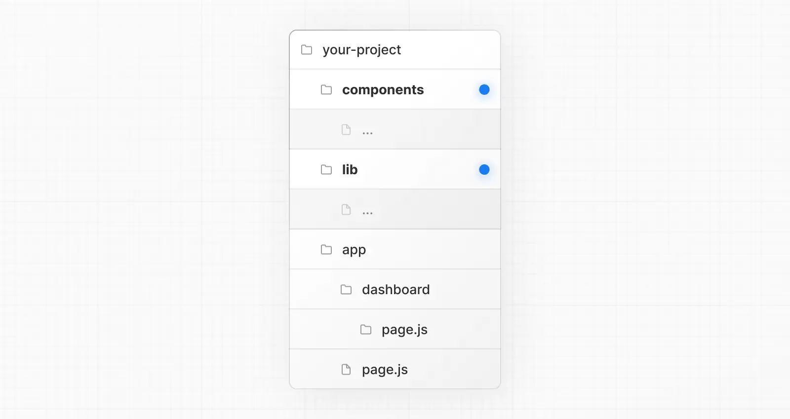
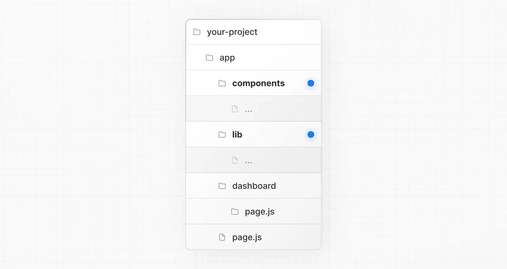
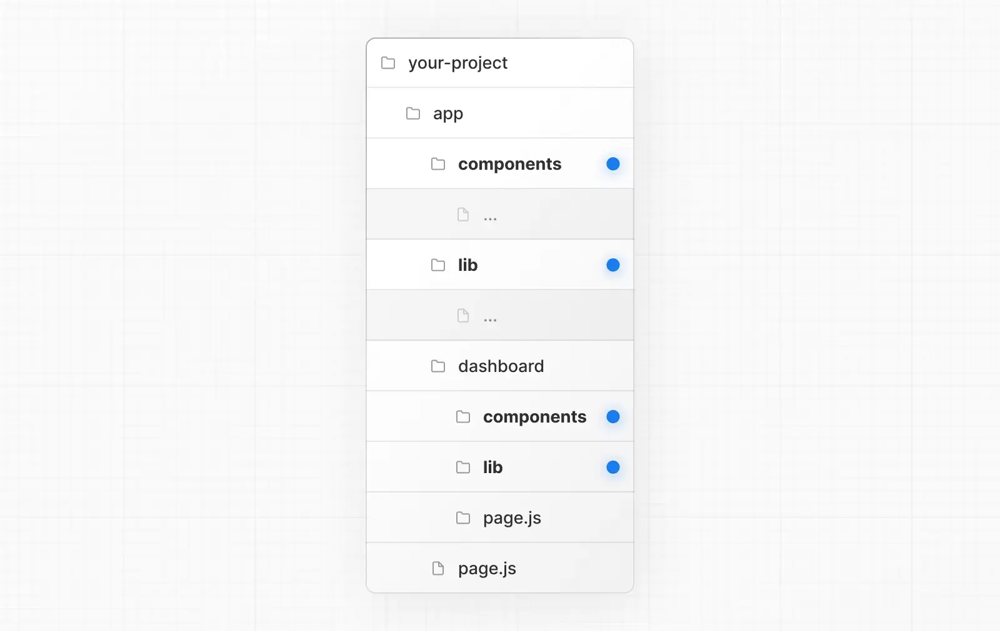
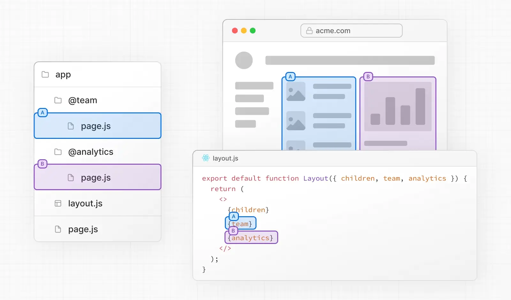
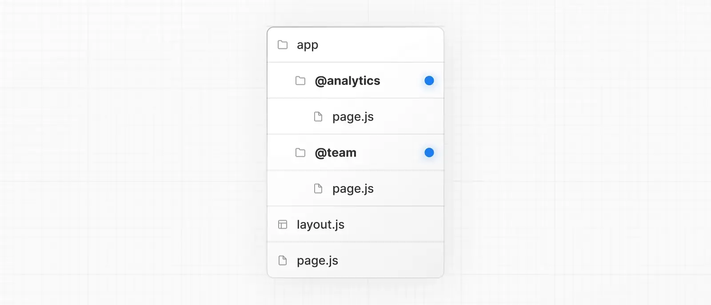
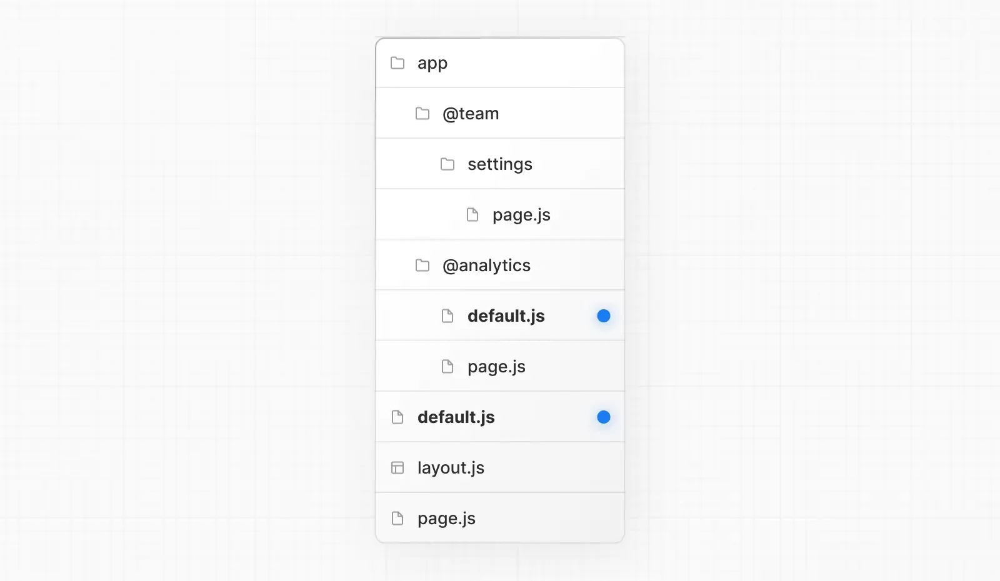

## Nextjs Learn

### Routing


#### Parallel Routes 并行路由

并行路由是通过命名 插槽 创建的。插槽使用 @folder 约定定义。

默认情况下，Next.js 会跟踪每个插槽的活动 状态 (或子页面)。但是，插槽内渲染的内容将取决于导航类型：

  + 软导航：在客户端导航期间，Next.js 将执行部分渲染，改变插槽内的子页面，同时保持其他插槽的活动子页面，即使它们不匹配当前 URL。
  + 硬导航：在完整页面加载 (浏览器刷新) 后，Next.js 无法确定不匹配当前 URL 的插槽的活动状态。相反，它将为不匹配的插槽渲染 default.js 文件，如果 default.js 不存在则渲染 404。

> 不匹配路由的 404 有助于确保你不会意外地在不适当的页面上渲染并行路由。

#### Project Organization 项目组织和文件并置

+ 默认安全并置
+ 项目组织功能
+ 项目组织策略

##### 项目组织功能：

+ 私有文件夹
  可以通过在文件夹名称前加下划线来创建私有文件夹: _folderName
  这表示该文件夹是私有实现细节，不应被路由系统考虑，从而将该文件夹及其所有子文件夹排除在路由之外。

  由于 app 目录中的文件默认可以安全并置，因此并置不需要私有文件夹。然而，它们可能对以下方面有用:

  + 分离 UI 逻辑和路由逻辑。
  + 在项目和 Next.js 生态系统中一致地组织内部文件。
  + 在代码编辑器中排序和分组文件。
  + 避免与未来 Next.js 文件约定可能发生的命名冲突。

+ 路由组
  可以通过将文件夹用括号括起来创建路由组: (folderName)
  这表示该文件夹用于组织目的，不应包含在路由的 URL 路径中。

  路由组对以下方面有用:
    + 将路由组织成组，例如按网站部分、意图或团队。
    + 在同一路由段级别启用嵌套布局:
    + 在同一段中创建多个嵌套布局，包括多个根布局
    + 为公共段中的一部分路由添加布局

+ src 目录
+ 模块别名路径


##### 项目组织策略

+ 将项目文件存储在 app 之外
  这种策略将所有应用程序代码存储在项目根目录的共享文件夹中，并将 app 目录纯粹用于路由目的。
  
+ 将项目文件存储在 app 内的顶级文件夹中
  这种策略将所有应用程序代码存储在 app 目录根目录的共享文件夹中。
  
+ 按功能或路由拆分项目文件
  这种策略将全局共享的应用程序代码存储在根 app 目录中，并将更具体的应用程序代码拆分到使用它们的路由段中。
  


#### Dynamic Routes 动态路由

当你事先不知道确切的段名称，并希望从动态数据创建路由时，可以使用在请求时填充或在构建时 预渲染 的动态段。

##### 生成静态参数

generateStaticParams 函数可与 动态路由段 结合使用，以在构建时 静态生成 路由，而不是在请求时按需生成。

generateStaticParams 函数的主要优势在于其智能数据检索。如果在 generateStaticParams 函数中使用 fetch 请求获取内容，这些请求会 自动被记忆化。这意味着在多个 generateStaticParams、布局和页面中使用相同参数的 fetch 请求只会执行一次，从而减少构建时间。

##### 捕获所有段

动态段可以通过在括号内添加省略号来扩展为 捕获所有 后续段：[...folderName]。

例如，app/shop/[...slug]/page.js 将匹配 /shop/clothes，同时也匹配 /shop/clothes/tops、/shop/clothes/tops/t-shirts 等。


|  路由     |示例 URL  | params    |
|----------|----------|---------- |
|app/shop/[...slug]/page.js|/shop/a|{ slug: ['a'] }|
|app/shop/[...slug]/page.js|/shop/a/b|{ slug: ['a', 'b'] }|
|app/shop/[...slug]/page.js|/shop/a/b/c|{ slug: ['a', 'b', 'c'] }|

##### 可选的捕获所有段

捕获所有段可以通过将参数包含在双方括号中来设为 可选：[[...folderName]]

例如，app/shop/[[...slug]]/page.js 除了匹配 /shop/clothes、/shop/clothes/tops、/shop/clothes/tops/t-shirts，还会 同时 匹配 /shop。

捕获所有 和 可选捕获所有 段的区别在于，可选的情况下，不带参数的路由也会被匹配 (上例中的 /shop)。

|路由 |示例URL |params |
|----|--------|--------|
|app/shop/[[...slug]]/page.js|/shop	|{}|
|app/shop/[[...slug]]/page.js|/shop/a|{ slug: ['a'] }|
|app/shop/[[...slug]]/page.js|/shop/a/b|{ slug: ['a', 'b'] }|
|app/shop/[[...slug]]/page.js|/shop/a/b/c|{ slug: ['a', 'b', 'c'] }|


#### Parallel Routes 并行路由

并行路由允许你在同一布局中同时或有条件地渲染一个或多个页面。它们对于应用程序中高度动态的部分非常有用，例如仪表板、购物车或多选步骤表单。


例如，考虑一个仪表盘，你可以使用并行路由同时渲染 "team" 和 "analytics" 页面：



##### 插槽

并行路由是通过命名 插槽 创建的。插槽使用 @folder 约定定义。例如，以下文件结构定义了两个插槽：@analytics 和 @team：



然而，插槽 不是 路由段，不会影响 URL 结构。例如，对于 /@analytics/views，URL 将是 /views，因为 @analytics 是一个插槽。
> children prop 是一个隐式插槽，不需要映射到文件夹。这意味着 app/page.js 等同于 app/@children/page.js。

##### 活动状态和导航

默认情况下，Next.js 会跟踪每个插槽的活动 状态 (或子页面)。但是，插槽内渲染的内容将取决于导航类型：

+ 软导航：在客户端导航期间，Next.js 将执行部分渲染，改变插槽内的子页面，同时保持其他插槽的活动子页面，即使它们不匹配当前 URL。
+ 硬导航：在完整页面加载 (浏览器刷新) 后，Next.js 无法确定不匹配当前 URL 的插槽的活动状态。相反，它将为不匹配的插槽渲染 default.js 文件，如果 default.js 不存在则渲染 404。

> 不匹配路由的 404 有助于确保你不会意外地在不适当的页面上渲染并行路由。


##### default.js

你可以定义一个 default.js 文件，作为初始加载或完整页面重新加载时未匹配插槽的回退渲染。

考虑以下文件夹结构。@team 插槽有一个 /settings 页面，但 @analytics 没有。




当导航到 /settings 时，@team 插槽将渲染 /settings 页面，同时保持 @analytics 插槽的当前活动页面。

在刷新时，Next.js 将为 @analytics 渲染一个 default.js。如果 default.js 不存在，则渲染 404。

此外，由于 children 是一个隐式插槽，你还需要创建一个 default.js 文件来为 children 渲染回退，以防 Next.js 无法恢复父页面的活动状态。

##### useSelectedLayoutSegment(s)

useSelectedLayoutSegment 和 useSelectedLayoutSegments 都接受一个 parallelRoutesKey 参数，允许你读取插槽内的活动路由段。

```tsx
"use client";

import { useSelectedLayoutSegment } from "next/navigation";

export default function Layout ({ auth }: { auth: React.ReactNode }) {
  const loginSegment = useSelectedLayoutSegment ("auth");
  // ...
}
```

当用户导航到 app/@auth/login (或 URL 栏中的 /login) 时，loginSegment 将等于字符串 "login"。
